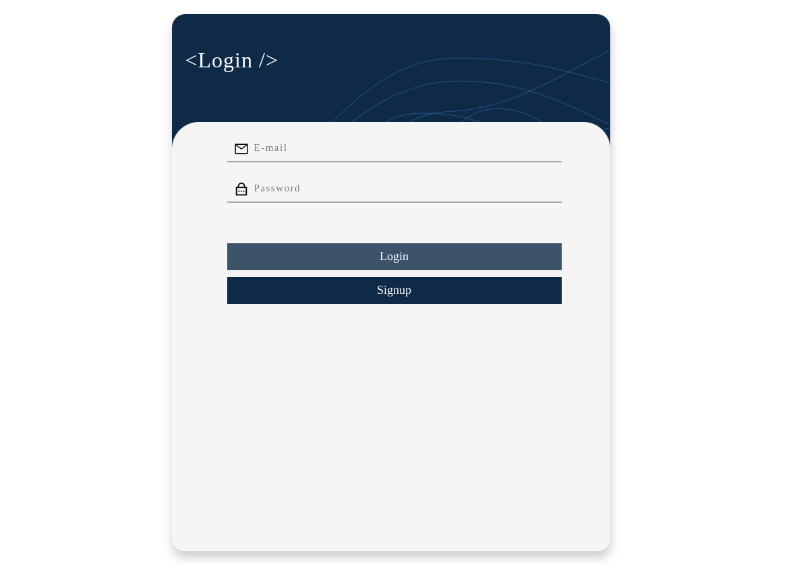
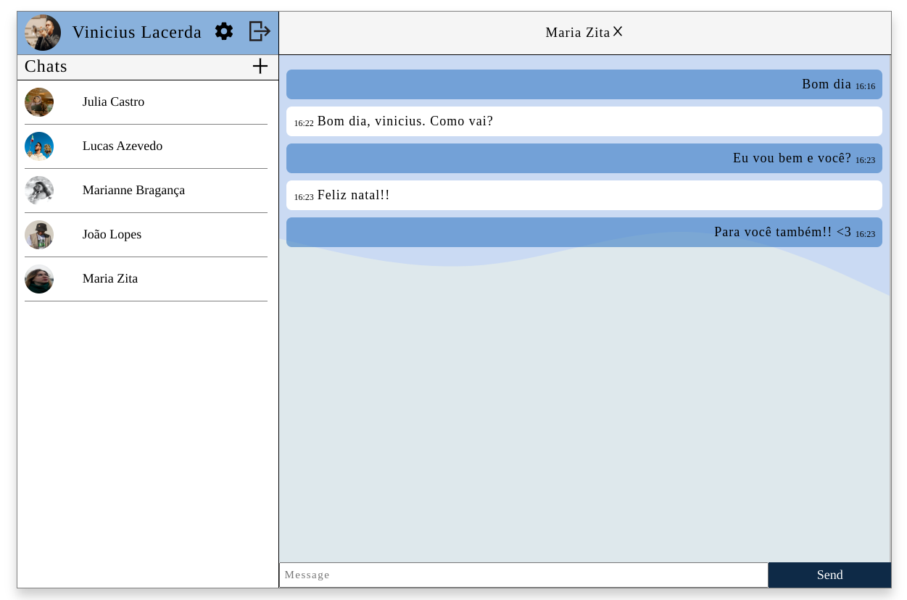
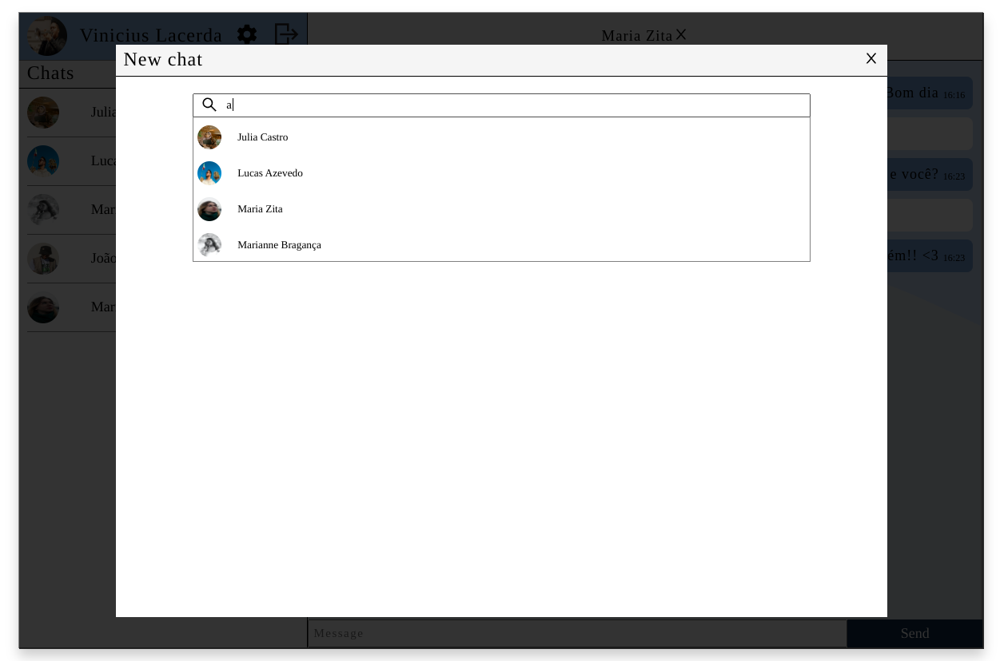
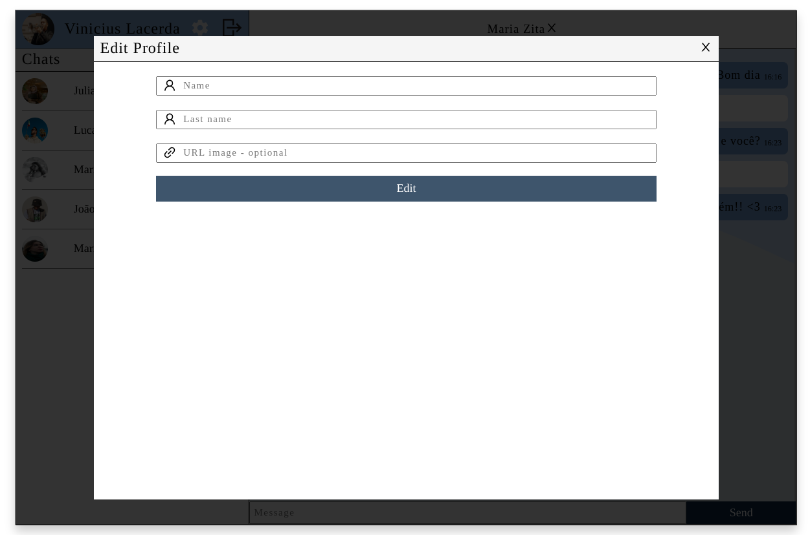

# Chat-Room Project

This project is a conversation application. It is possible to create new conversations with any registered user.

## Technologies Used

  ### Back-end
    - Node.js
    - Express
    - TypeScript
    - Web Socket
    - MySQL
    - Sequelize
    - Cors
  
  ### Front-end
    - React.js
    - CSS3
    - Axios
    - ContextAPI

  ### Tools
    - Docker
    - Git

## Overview

Users should be able to:

- Login and register;
- Create new chat with any registered user;
- Send messages;
- Edit your profile;

## Local Usage

1) Make sure you have Docker installed
2) Clone this repo
3) in the root folder run: $ docker-compose up -d --build
3) run: $ docker exec -it ch-back sh
4) run: $ npx sequelize-cli db:drop && npx sequelize-cli db:create && npx sequelize-cli db:migrate && npx sequelize-cli db:seed:all
5) Access _[localhost:3000](http://localhost:3000/)_ to interact with the application.

## Login

There are six previously registered users:

<table border="1">
    <tr>
      <td><b>E-mail</></td>
      <td><b>Password</b></td>
    </tr>
    <tr>
      <td>julia@email.com</td>
      <td>Senha123</td>
    </tr>
    <tr>
      <td>joao@email.com</td>
      <td>Senha123</td>
    </tr>
    <tr>
      <td>lucas@email.com</td>
      <td>Senha123</td>
    </tr>
    <tr>
      <td>vinicius@email.com</td>
      <td>Senha123</td>
    </tr>
    <tr>
      <td>marianne@email.com</td>
      <td>Senha123</td>
    </tr>
    <tr>
      <td>zita@email.com</td>
      <td>Senha123</td>
    </tr>
</table>

### Screenshots

  
  
  
  

